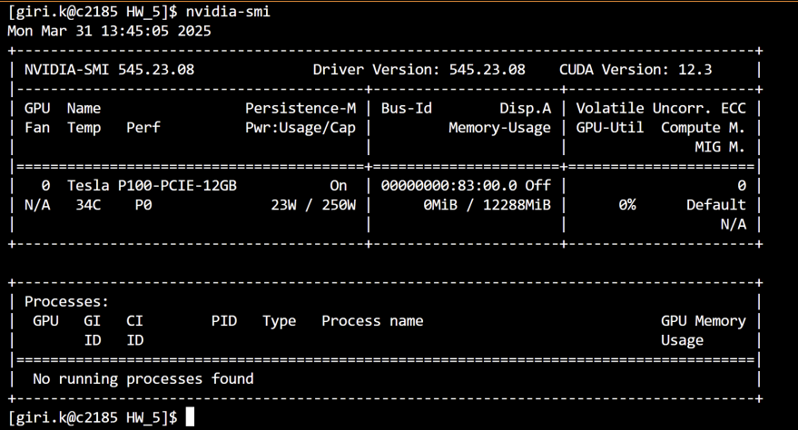
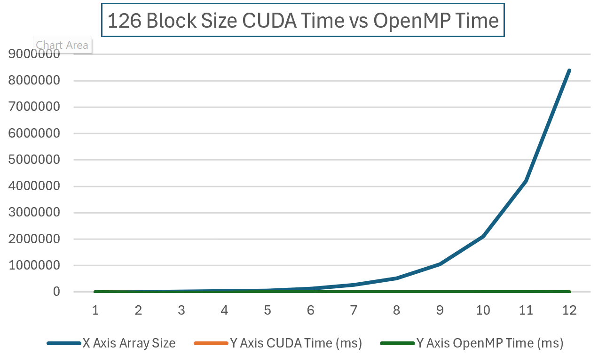
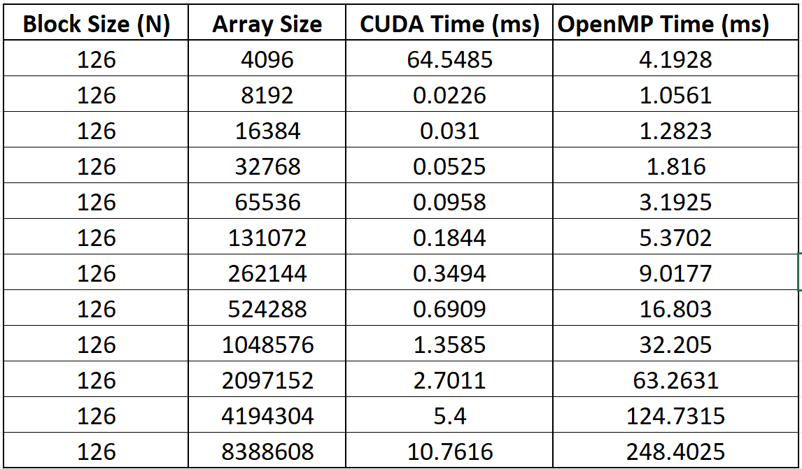
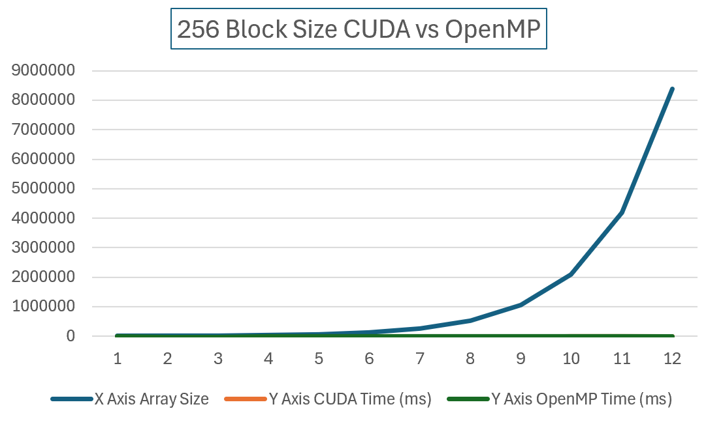
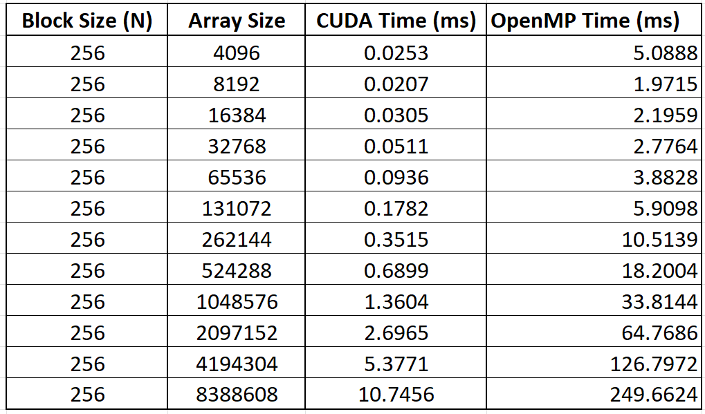
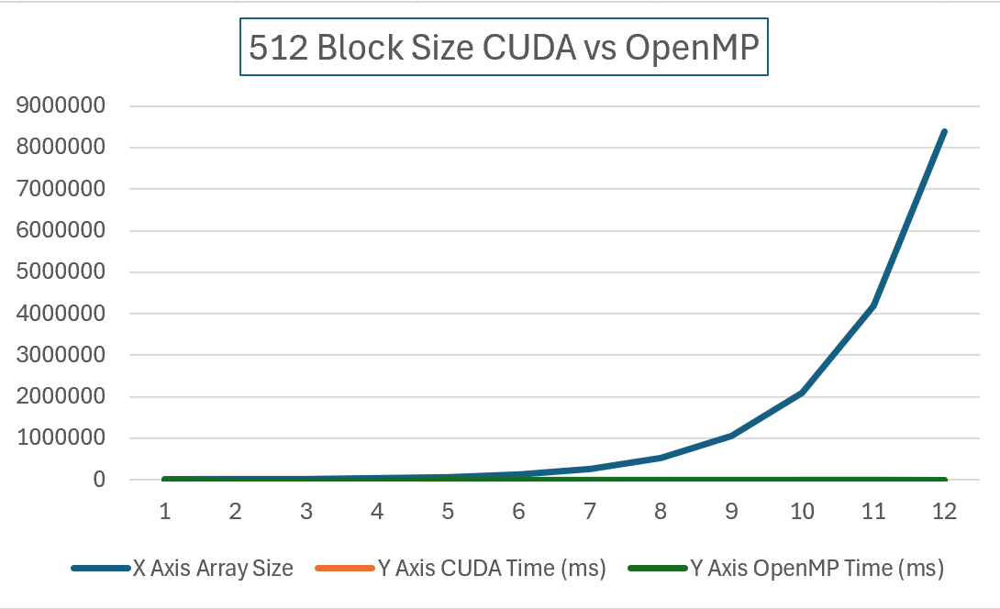
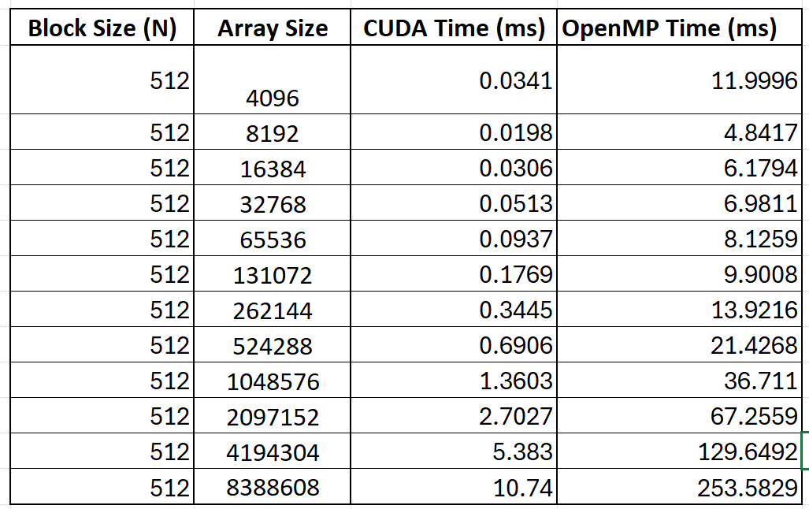
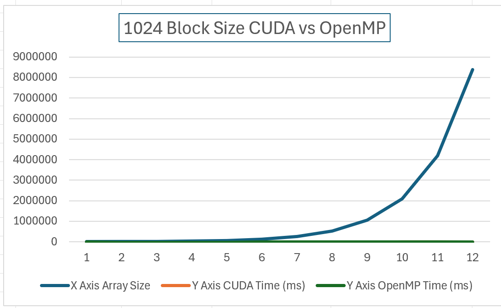
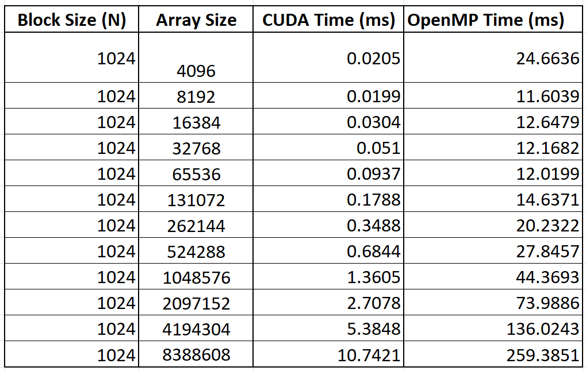

# CUDA vs OpenMP Parallel Histogram Performance

This project studies the performance of parallel histogram computation on a GPU with CUDA and on a CPU with OpenMP. The same histogram workload is executed across increasing array sizes, from `2^12` to `2^23`, and across four CUDA block size / OpenMP thread-count settings: `126`, `256`, `512`, and `1024`.

The original analysis report is included here: [ParallelHistogramComputation_GPUvsCPU_Performance_Analysis_using_CUDA&OpenMP.pdf](ParallelHistogramComputation_GPUvsCPU_Performance_Analysis_using_CUDA&OpenMP.pdf).

## Experiment Setup

| Component | Configuration |
|---|---|
| GPU | NVIDIA Tesla P100 |
| CPU | Intel Xeon E5-2680 v4 @ 2.40 GHz |
| CUDA workload | Global-memory histogram with `atomicAdd` |
| OpenMP workload | CPU histogram with `#pragma omp parallel for` and atomic updates |
| Data range | Random integers from `1` to `100000` |
| Histogram bins | `10` equal-width bins |
| Array sizes | `4096` to `8388608` elements |



## Result Interpretation

The performance pattern is clear: CUDA dominates once the problem is large enough to amortize GPU launch and transfer overhead. The OpenMP implementation is useful as a CPU baseline, but its runtime grows much faster as the array size increases.

| Block size / threads | Array size | CUDA time (ms) | OpenMP time (ms) | Speedup |
|---:|---:|---:|---:|---:|
| 126 | 8388608 | 10.7616 | 248.4025 | 23.08x |
| 256 | 8388608 | 10.7456 | 249.6624 | 23.23x |
| 512 | 8388608 | 10.7400 | 253.5829 | 23.61x |
| 1024 | 8388608 | 10.7421 | 259.3851 | 24.15x |

Key observations:

- CUDA reaches roughly `23x` to `24x` speedup on the largest input size.
- The CUDA timings stay close across block sizes for large arrays, showing stable GPU scaling.
- The OpenMP runtime increases sharply as the array size grows, mainly because the CPU has fewer execution resources and atomic updates create contention.
- A cold-start CUDA outlier appears for the `126` block-size run at `4096` elements, where OpenMP is faster. For the broader workload, CUDA is consistently ahead.

The complete numeric table is available in [results/performance_results.csv](results/performance_results.csv).

## Result Figures

The figures below are extracted from the original report so the README uses the same visual evidence as the submitted document.

### Block Size 126

<p align="center">
  
  
</p>

### Block Size 256

<p align="center">
  
  
</p>

### Block Size 512

<p align="center">
  
  
</p>

### Block Size 1024

<p align="center">
  
  
</p>

All extracted report images are listed in [assets/report-figures/MANIFEST.md](assets/report-figures/MANIFEST.md).

## Repository Structure

```text
.
|-- CUDA_Parallel_Histogram.cu
|-- OpenMP_Parallel_Histogram.c
|-- Makefile
|-- makefile.txt
|-- README.md
|-- results/
|   `-- performance_results.csv
|-- assets/
|   `-- report-figures/
|-- ParallelHistogramComputation_GPUvsCPU_Performance_Analysis_using_CUDA&OpenMP.pdf
```

## Build and Run

On an HPC system with CUDA and OpenMP support, load CUDA first:

```bash
module load cuda/12.3.0
```

Request an interactive GPU node:

```bash
srun -p courses-gpu --gres=gpu:p100:1 --pty --time=03:00:00 /bin/bash
```

or:

```bash
srun -p courses-gpu --gres=gpu:v100-sxm2:1 --pty --time=03:00:00 /bin/bash
```

Compile and run the CUDA version:

```bash
make cudarun
```

Compile and run the OpenMP version:

```bash
make openmprun
```

Build both programs:

```bash
make all
```

Clean generated binaries:

```bash
make clean
```

## Conclusion

CUDA on the Tesla P100 provides a strong advantage for moderate and large histogram workloads. The GPU implementation is especially effective at higher data volumes, while the OpenMP CPU implementation is only competitive for very small or cold-start cases. For large-scale histogram computation, the CUDA approach is the better-performing and more scalable solution in this experiment.
